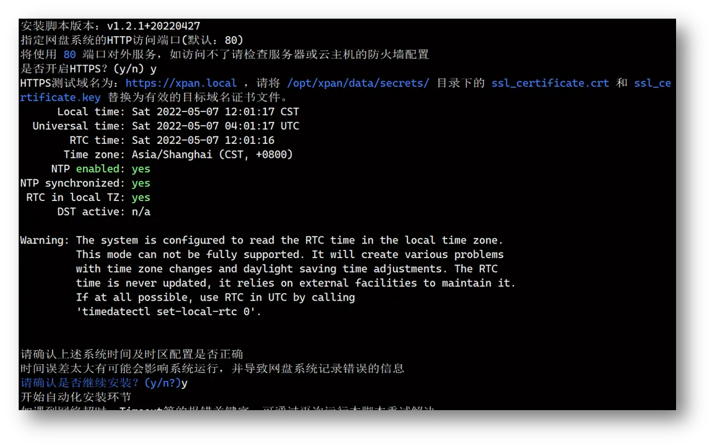

# 安装部署

## 步骤一：准备服务器主机

* 操作系统兼容主流Linux发行版，包括Redhat/Centos/Debian/Ubuntu；
* 主流CPU型号，无特殊要求；
* 系统内存最低 4GB，推荐8GB以上（内存直接影响了系统运行任务的性能）；
* 网络带宽最低 4Mb/s，推荐20Mb/s（带宽直接影响文档上传下载的体验）；
* 磁盘存储最低 10GB（后续可按需扩容）

## 步骤二：运行自动化脚本

```
# 适用于内置curl的Linux发行版
sudo curl https://ota.xpan.ekbcloud.com/app/xpan-install.sh --output xpan-install.sh && sudo bash ./xpan-install.sh

# 适用于内置 wget 的Linux发行版
sudo wget https://ota.xpan.ekbcloud.com/app/xpan-install.sh -O xpan-install.sh && sudo bash ./xpan-install.sh
```

丰盘ECM软件采取DOCKER容器化技术安装，操作系统层面不需要预装任何软件， 脚本会自动检测DOCKER环境是否存在，如果不存在，则会自动安装DOCKER环境。

> :bulb:丰盘ECM软件安装脚本需要从DOCKER仓库源（ https://hub.docker.com/ ）拉取镜像， 国内多数城市实测访问速度尚可，如遇Network error、Timeout、超时等错误字样，可简单的重新运行脚本即可。

运行脚本之后，丰盘安装程序会询问一些必要参数，如下：

1. 丰盘对外使用的端口？；
2. 是否开启HTTPS？
3. 当前系统时间是否需要修正？

如果开启HTTPS，则系统会绑定443端口及默认证书，用户可以在安装完成之后，使用企业正式的网盘域名证书替代掉默认证书，即可通过https访问网盘系统。

为了确保系统时间正确，管理员需要手工确认下服务器时间是否需要正确，此时间主要影响系统的操作日志、文件创建时间、删除时间等信息，如果时间偏差太大可能会导致系统运行不正常。



以上问题确认完毕之后系统就进入自动化安装模式，安装程序将自动拉取最新稳定版的镜像文件，并自动化配置好相应的容器参数。

安装完成之后，系统将自动打印丰盘系统所使用的Postgresql数据库的管理员密码，以便后续排障或人工维护时使用。以及丰盘系统网页端登录时使用的管理员账号及初始密码，管理员可通过IP登录系统，并按系统要求重置管理员密码，然后按系统提示输入许可证进行系统激活。

.png>)

## 步骤三：免费获得许可证授权码

访问 [丰盘许可证站点 (ekbcloud.com)](https://ota.xpan.ekbcloud.com/app/)， 使用您的企业邮箱注册并获得丰盘社区版的许可证，然后从邮箱中获取许可证填入丰盘ECM系统激活即可。

> :bulb:丰盘产品仅面向企业用户开放，不支持使用 163.com/qq.com/gmail.com 等个人邮箱注册，需要使用您的企业邮箱注册， 后续的产品更新、许可证管理等均绑定此注册邮箱。


## 常见问题

**安装过程中途报错怎么办？**

丰盘ECM安装程序一旦进入自动化安装环节，会从DOCKER HUB拉取安装镜像文件，大约500MB，期间比较容易由于网络原因如网速较慢、网络不稳定、断网、超时等问题导致镜像文件拉取失败。此时可简单的重新运行脚本进行安装即可。如遇到其他问题，可到产品反馈站点向我们反馈。

**如何使用我自己公司的HTTPS证书访问丰盘系统？**

在安装阶段选择了开启HTTPS的话，丰盘系统会绑定内置的自颁发的测试证书，可以先通过访问 https://xpan.local/app/ 访问系统（注意，请先通过hosts修改xpan.local域名指向部署的主机IP），如果提示证书不安全，说明HTTPS初始配置是正确的。

然后登录丰盘系统所在主机，访问丰盘工作目录下的证书目录 **cd /opt/xpan/data/secrets/** `，然后将贵公司的HTTPS证书（针对nginx的）的key和crt后缀的两个文件，更名之后替换掉证书目录下的同后缀文件，然后运行`` `**`docker restart xpan-gw`**` ``命令重启丰盘系统网关，使用贵公司的HTTPS域名访问丰盘系统即可。`

.png>)

