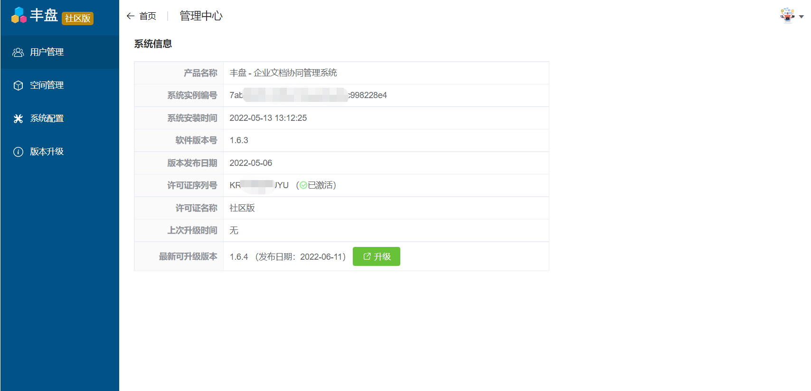
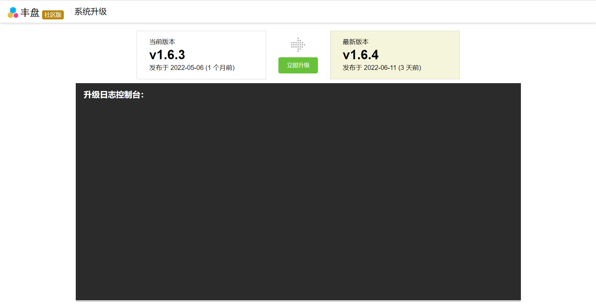
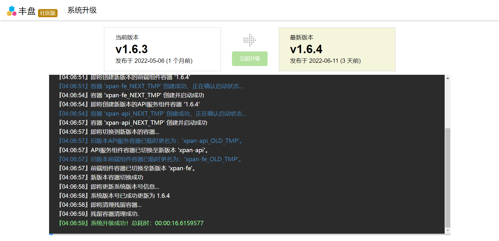

# 如何升级

丰盘ECM支持在线自动化升级，无需手工下载拷贝升级包。

使用系统管理员账号登录系统，点击系统右上角菜单的『系统管理』，点击左侧菜单的『版本升级』界面里上的『检测』按钮。如果发现新版本，可以点击升级按钮跳转到系统升级向导界面。

.png>)

系统升级界面点击『立即升级』按钮，即可进入自动化升级过程。


升级期间会有短暂的系统不可访问，需要管理员妥善安排好升级计划。


升级成功后即可访问新系统。升级过程如果出现错误，例如新版本镜像下载失败，或者其他意外错误，升级过程将会自动回滚到旧版本。

**升级遇到问题？可以查看下面常见问题，或访问产品反馈论坛留言给我们** :relaxed:


[chang-jian-wen-ti.md](chang-jian-wen-ti.md)



